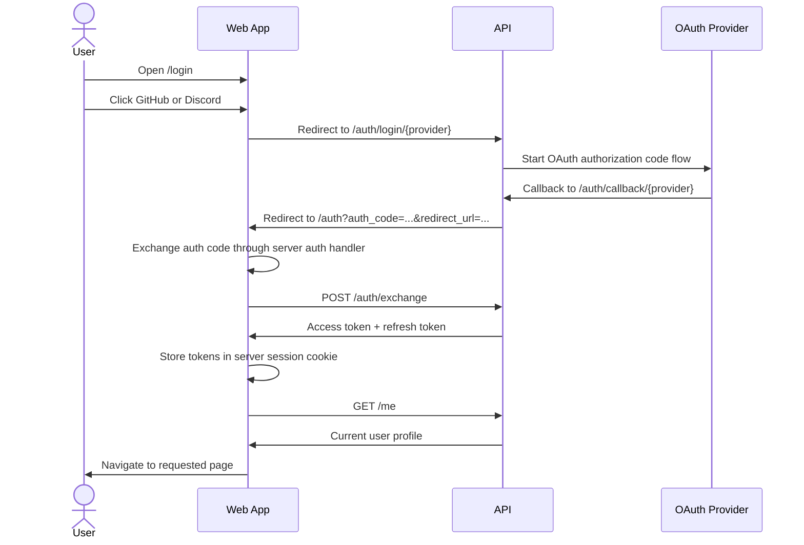
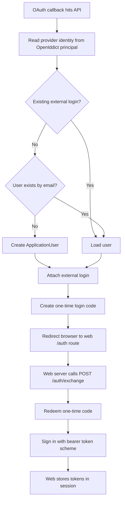
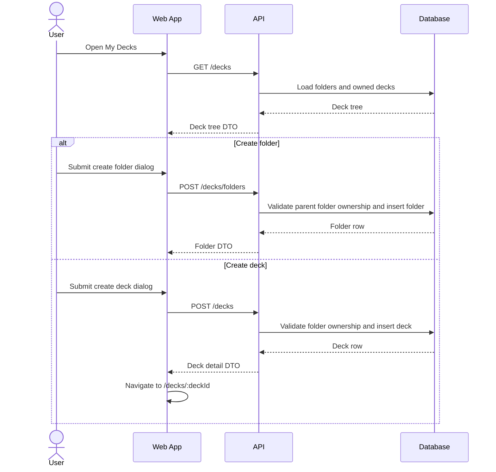
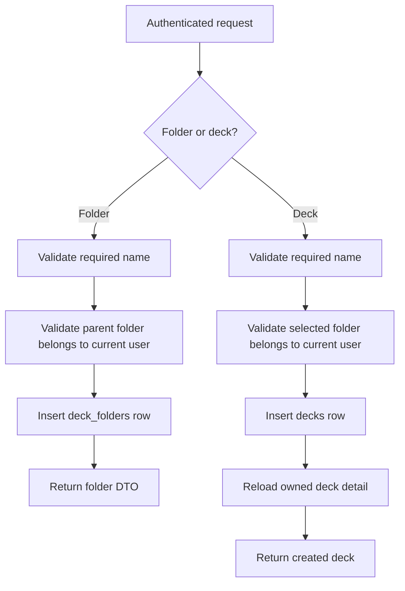
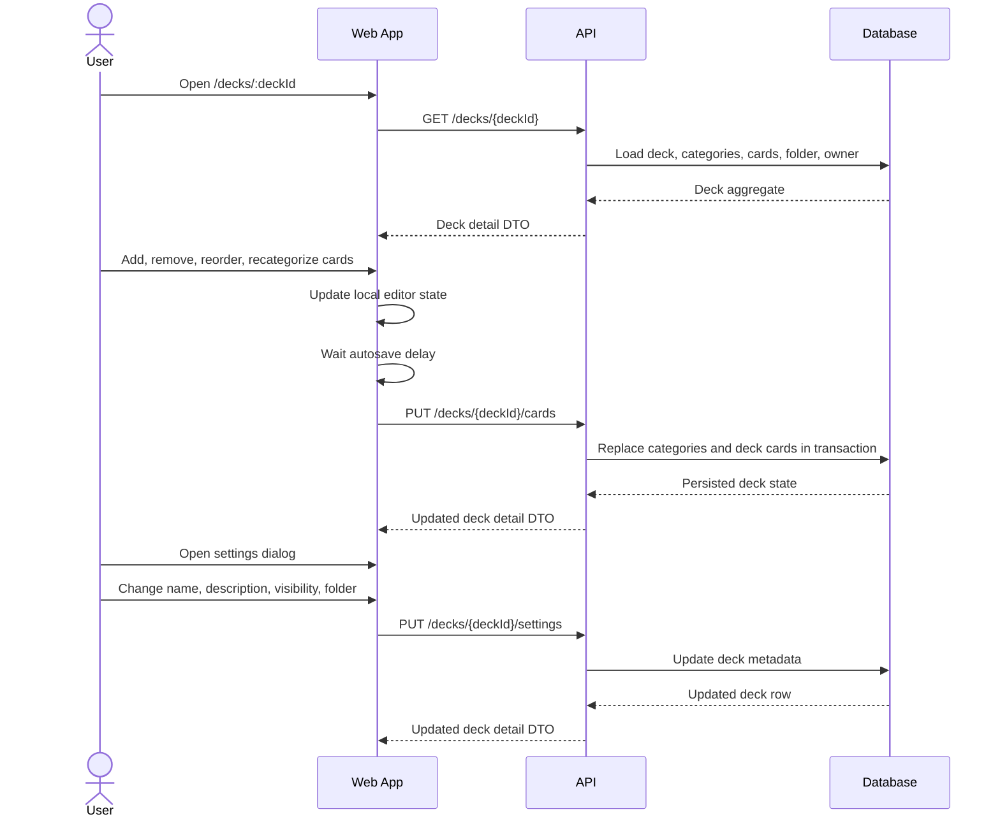
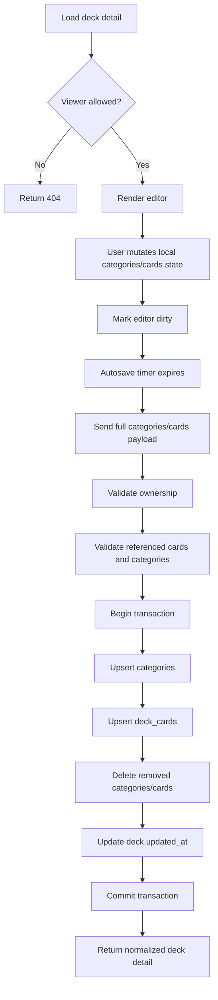

# Application Flows

## Auth Flow

### User Flow

```mermaid
sequenceDiagram
    actor U as User
    participant W as Web App
    participant A as API
    participant O as OAuth Provider

    U->>W: Open /login
    U->>W: Click GitHub or Discord
    W->>A: Redirect to /auth/login/{provider}
    A->>O: Start OAuth authorization code flow
    O->>A: Callback to /auth/callback/{provider}
    A->>W: Redirect to /auth?auth_code=...&redirect_url=...
    W->>W: Exchange auth code through server auth handler
    W->>A: POST /auth/exchange
    A->>W: Access token + refresh token
    W->>W: Store tokens in server session cookie
    W->>A: GET /me
    A->>W: Current user profile
    W->>U: Navigate to requested page
```

### Logic Flow

```mermaid
flowchart TD
    A1[OAuth callback hits API] --> A2[Read provider identity from OpenIddict principal]
    A2 --> A3{Existing external login?}
    A3 -- Yes --> A6[Load user]
    A3 -- No --> A4{User exists by email?}
    A4 -- No --> A5[Create ApplicationUser]
    A4 -- Yes --> A6
    A5 --> A7[Attach external login]
    A6 --> A7
    A7 --> A8[Create one-time login code]
    A8 --> A9[Redirect browser to web /auth route]
    A9 --> A10[Web server calls POST /auth/exchange]
    A10 --> A11[Redeem one-time code]
    A11 --> A12[Sign in with bearer token scheme]
    A12 --> A13[Web stores tokens in session]
```

## Folder and Deck Creation Flow

### User Flow

```mermaid
sequenceDiagram
    actor U as User
    participant W as Web App
    participant A as API
    participant D as Database

    U->>W: Open My Decks
    W->>A: GET /decks
    A->>D: Load folders and owned decks
    D-->>A: Deck tree
    A-->>W: Deck tree DTO

    alt Create folder
        U->>W: Submit create folder dialog
        W->>A: POST /decks/folders
        A->>D: Validate parent folder ownership and insert folder
        D-->>A: Folder row
        A-->>W: Folder DTO
    else Create deck
        U->>W: Submit create deck dialog
        W->>A: POST /decks
        A->>D: Validate folder ownership and insert deck
        D-->>A: Deck row
        A-->>W: Deck detail DTO
        W->>W: Navigate to /decks/:deckId
    end
```

### Logic Flow

```mermaid
flowchart TD
    F1[Authenticated request] --> F2{Folder or deck?}

    F2 -- Folder --> F3[Validate required name]
    F3 --> F4[Validate parent folder belongs to current user]
    F4 --> F5[Insert deck_folders row]
    F5 --> F6[Return folder DTO]

    F2 -- Deck --> D1[Validate required name]
    D1 --> D2[Validate selected folder belongs to current user]
    D2 --> D3[Insert decks row]
    D3 --> D4[Reload owned deck detail]
    D4 --> D5[Return created deck]
```

## Deck Editing Flow

### User Flow

```mermaid
sequenceDiagram
    actor U as User
    participant W as Web App
    participant A as API
    participant D as Database

    U->>W: Open /decks/:deckId
    W->>A: GET /decks/{deckId}
    A->>D: Load deck, categories, cards, folder, owner
    D-->>A: Deck aggregate
    A-->>W: Deck detail DTO

    U->>W: Add, remove, reorder, recategorize cards
    W->>W: Update local editor state
    W->>W: Wait autosave delay
    W->>A: PUT /decks/{deckId}/cards
    A->>D: Replace categories and deck cards in transaction
    D-->>A: Persisted deck state
    A-->>W: Updated deck detail DTO

    U->>W: Open settings dialog
    U->>W: Change name, description, visibility, folder
    W->>A: PUT /decks/{deckId}/settings
    A->>D: Update deck metadata
    D-->>A: Updated deck row
    A-->>W: Updated deck detail DTO
```

### Logic Flow

```mermaid
flowchart TD
    E1[Load deck detail] --> E2{Viewer allowed?}
    E2 -- No --> E3[Return 404]
    E2 -- Yes --> E4[Render editor]

    E4 --> E5[User mutates local categories/cards state]
    E5 --> E6[Mark editor dirty]
    E6 --> E7[Autosave timer expires]
    E7 --> E8[Send full categories/cards payload]
    E8 --> E9[Validate ownership]
    E9 --> E10[Validate referenced cards and categories]
    E10 --> E11[Begin transaction]
    E11 --> E12[Upsert categories]
    E12 --> E13[Upsert deck_cards]
    E13 --> E14[Delete removed categories/cards]
    E14 --> E15[Update deck.updated_at]
    E15 --> E16[Commit transaction]
    E16 --> E17[Return normalized deck detail]
```
