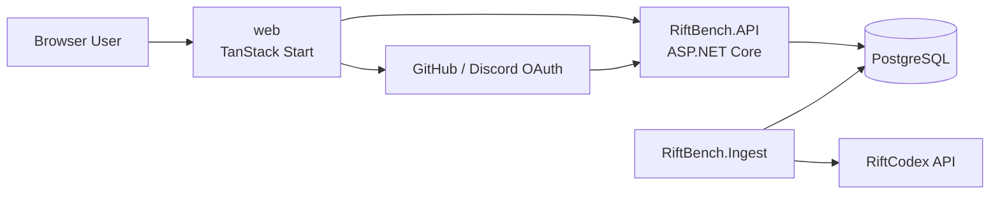

# Architecture Overview

## Overview

RiftBench is a full-stack deck-building application for Riftbound.

At a high level:

- `web/` is the TanStack Start frontend and SSR host
- `RiftBench.API/` is the ASP.NET Core API
- `RiftBench.Data/` contains the EF Core model and PostgreSQL schema
- `RiftBench.Ingest/` imports card and set data from the external RiftCodex API

The application has two main domains:

1. A read-heavy card catalog
2. A user-owned deck library with folders, deck settings, and editable deck contents

## High-Level Architecture

## Repository Structure

### Main Projects

- `web/`
  - frontend routes, SSR handlers, auth session handling, generated API client
- `RiftBench.API/`
  - authentication endpoints
  - card browse/detail APIs
  - deck and folder APIs
- `RiftBench.Data/`
  - EF Core entities
  - `AppDbContext`
  - migrations
- `RiftBench.Ingest/`
  - one-shot card-set ingestion job

### Important Internal Boundaries

- `RiftBench.API/Services/CardSearchService.cs`
  - search, filtering, sorting, and card detail projection
- `RiftBench.API/Services/DeckService.cs`
  - deck tree loading
  - ownership and visibility rules
  - folder CRUD
  - deck CRUD
  - deck contents replacement
- `web/src/server/auth.ts`
  - server-side session storage and token refresh
- `web/src/lib/auth.tsx`
  - browser auth state and API bearer token wiring

## Request and State Model

### Auth State

- The API issues bearer tokens using ASP.NET Core Identity endpoints.
- The web app stores those tokens in a TanStack Start server session cookie.
- The browser does not directly manage refresh tokens.
- The frontend API client receives the access token from the SSR auth layer and sends it as `Authorization: Bearer ...`.

### Deck Editing State

- Deck settings are saved explicitly from the settings dialog.
- Deck contents are edited client-side and autosaved after a short delay.
- The API persists deck contents with a full replacement operation:
  - categories are upserted
  - missing categories are removed
  - deck cards are upserted
  - removed cards are deleted

## Current Design Characteristics

- The API is thin at the controller level and pushes most business logic into services.
- The deck editor uses coarse-grained replacement writes instead of granular patch endpoints.
- Search is database-driven and leans on PostgreSQL full-text search and indexes.
- Auth is split across:
  - OAuth provider orchestration in the API
  - token/session management in the web SSR layer
- Ingest is intentionally separate from request-serving code and runs as a one-shot job.
