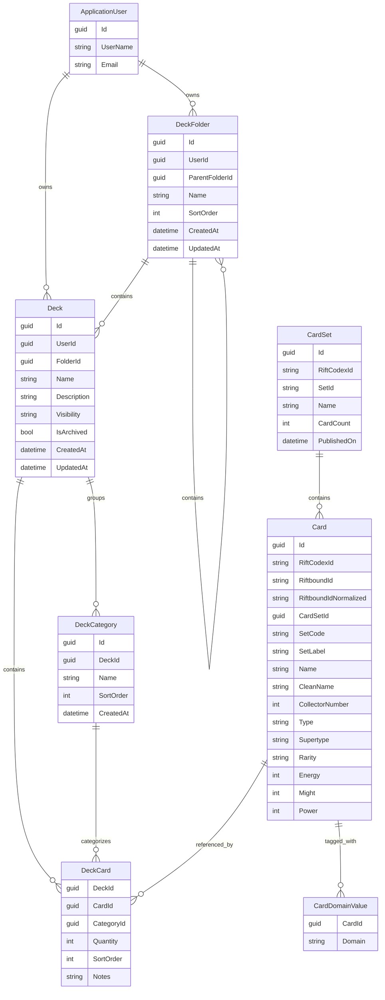

# Database Entities

## Core Relationships

## Entity Notes

### Identity and Ownership

- `ApplicationUser`
  - standard ASP.NET Core Identity user
  - owns all folders and decks

### Deck Library

- `DeckFolder`
  - user-owned hierarchical folder tree
  - parent folder is optional
- `Deck`
  - belongs to a user
  - optionally belongs to a folder
  - visibility is `Private`, `Unlisted`, or `Public`
  - can be archived without being deleted
- `DeckCategory`
  - custom grouping buckets inside one deck
- `DeckCard`
  - join entity between a deck and a card
  - stores quantity, category assignment, sort order, and optional notes

### Card Catalog

- `CardSet`
  - imported set metadata
- `Card`
  - imported card record with search and display fields
- `CardDomainValue`
  - many-to-one domain tags for cards
